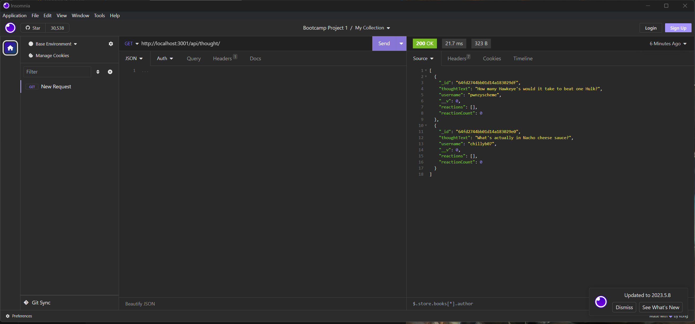

# Working with MongoDB

## Video Walkthrough
[A Functionality Walkthrough](https://www.youtube.com/watch?v=wItUSbTYxdk&ab_channel=BenPoole)

## Description
This is an application that connects to a mongoDB database and has routes to alter the database.

## Installation
N/A
    
## Usage
The user is able to:  
GET, POST, PUT, and DELETE users.  
GET, POST, PUT, and DELETE thoughts.  
They can also POST and DELETE reactions to thoughts.  

    
## Contribution Guidelines
N/A
    
## License
N/A
    
## Email Address
If you have any questions or concerns please reach out to me at bpoole53@gmail.com